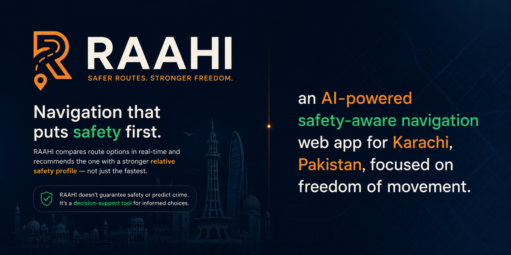

[](https://react.dev/)
[](https://vitejs.dev/)
[](https://www.typescriptlang.org/)
[](https://tailwindcss.com/)
[](LICENSE)
[](https://raahi-safe-routes.lovable.app)

# RAAHI

Build RAAHI, an AI-powered safety-aware navigation web app for Karachi, Pakistan, focused on women's freedom of movement.

Core pitch: Maps optimize for time. RAAHI optimizes for safety.

Traditional navigation answers "what's the fastest way?" RAAHI answers "given current conditions, what's the safer way?" It compares route options and recommends the one with the stronger relative safety profile, not just the fastest one — and explains why.

RAAHI never claims to guarantee safety or predict crime. It's a decision-support tool. Always use the words "safer route" and "relative safety score," never "safe route" or "risk of attack."

Tech stack

Single-page web app: React (or plain HTML/JS if the builder prefers) + Tailwind CSS

Map: MapTiler (I have an API key I'll provide) for tiles, with a fallback to free OpenStreetMap tiles if the key fails to load, so the map never breaks

Routing: OSRM public routing API (router.project-osrm.org) for walking directions between two points, requesting alternative routes

Geocoding: OpenStreetMap Nominatim as primary search (no key needed), MapTiler Geocoding as secondary

No backend/database required for the MVP — everything runs client-side

Core feature: Safety Intelligence Engine (simulated for demo)

Since real crime/lighting datasets aren't available for the hackathon, simulate the signals deterministically (same location always produces the same base values, so the demo is consistent) using these categories, each contributing to a weighted 0–100 Relative Safety Score per route:

Lighting (~25%) — worse at night unless a location's seeded "quality" is high

Street/pedestrian activity (~20%) — follows a realistic time-of-day curve (peaks daytime/early evening, drops late night)

Historical incident density (~25%) — static per location, seeded

Businesses currently open (~15%) — depends on simulated closing hours vs. current time

Nearby verified Safe Points (~15%) — pharmacies, hospitals, cafes, police points seeded along the route

Required user flow

User enters From and To (Karachi only — bias search and restrict map bounds to Karachi)

App fetches 2 route alternatives and scores each

Routes render on the map, color-coded: green (score ≥70), amber (45–69), red (<45). The higher-scoring route is highlighted as Recommended

Each route shows: time, safety score, a short explainability list (3–5 plain-language factors like "Poor lighting along this stretch" or "Active businesses currently open"), and a one-line recommendation comparing the time tradeoff vs. the safer alternative (e.g. "This route adds 4 minutes but currently has a stronger safety profile.")

Time-of-day slider (0:00–23:59): moving it live recalculates all scores. If the recommended route changes, show a brief "Recalculating…" toast. This live rerouting moment is the single most important feature of the demo — it must work smoothly.

Verified Safe Point markers shown on the map near routes

Design direction

Dark, confident navigation-app aesthetic — not a generic SaaS card layout, not a cream/terracotta AI-cliché palette

Base: deep navy/charcoal background (#0E1420 / #141C2B), off-white text (#EDEBE3), amber accent for wayfinding (#F2A65A), teal-green for safe (#3FC98A), coral for risk (#E6604F)

One clean geometric sans-serif typeface throughout

Layout: left sidebar (search, time slider, route cards), full-height map on the right

No fear-based imagery or language (no "danger," "victim," "panic"). Tone is about independence, confidence, and informed movement, not warnings

What RAAHI must NOT become

Do not add: an AI chatbot/therapist persona, an SOS panic button as the main feature, a plain crime map, police-reporting features, or any claim that predicts where crime will happen. Every feature must serve one goal: helping someone make a more informed route decision right now.

Explainability example (match this style)

Route A — 11 min — Safety Score: 44/100

- Poor lighting
- Low evening activity
- Few open businesses
- Recent community reports

Route B — 15 min — Safety Score: 86/100

- Better lighting
- Main road
- Active businesses
- Nearby pharmacy (verified safe point)

"This route takes about 4 minutes longer but currently has a stronger safety profile."

Constraints for the builder

Karachi bounding box only: lat 24.72–25.20, lon 66.75–67.35

Everything must work as a static/client-only app — no server, no user accounts, no real data collection for this MVP

Handle geocoding/routing failures gracefully with a clear on-screen message, never a silent blank state

Mobile-responsive (stack sidebar above map on narrow screens)

My MapTiler API key: [dLggrfwsbIFlX8Ky2lmT]

This project was built with [Lovable](https://lovable.dev).

**Live app**: https://raahi-safe-routes.lovable.app

## Build with Lovable

Continue developing this project in the [Lovable editor](https://lovable.dev/projects/81b9cc47-c526-4813-b20d-5b93c3dbf66b).

- **Ship faster**: describe what you want to build and Lovable handles the code.
- **Stay in sync**: every change made in Lovable is committed straight to this repository.
- **Full ownership**: this code is yours. Push to `main` on GitHub and your changes sync back into Lovable, ready for your next prompt.

## Development

Prefer working locally? You need Node.js and npm — [install with nvm](https://github.com/nvm-sh/nvm#installing-and-updating).

```sh
git clone <this-repository-url>
cd <repository-name>
npm i
npm run dev
```
