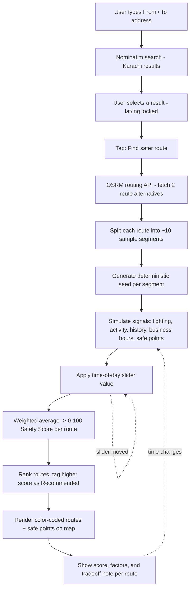

# RAAHI — How It Works

**Maps optimize for time. RAAHI optimizes for safety.**

RAAHI is a prototype safety-aware navigation app for Karachi. It compares route options between two points and recommends the one with the stronger *relative* safety profile, not just the fastest one — with a plain-language explanation of why.

This document walks through the full workflow, brick by brick.

---

## Flow chart

---

## Workflow

### 1. User location input
The user types an address into the **From** and **To** fields. After a short debounce (~300–350ms per keystroke), the app queries OpenStreetMap's Nominatim search API and shows matching Karachi locations in a dropdown.

### 2. Selection locks coordinates
When the user picks a result from the dropdown, that location's exact latitude/longitude is stored on the input field. These coordinates are what get used for routing in the next step.

### 3. Route fetch (OSRM)
Tapping **Find safer route** sends both coordinates to OSRM (a free, public routing engine), which returns the walking route geometry — the full path — plus a second alternative route.

### 4. Splitting the route into segments
Each route's path is broken into ~10 sample points. Every point gets a **deterministic seed** derived from its exact lat/lng, so the same real-world location always produces the same base signal values (consistent demo, not random flicker on every run).

### 5. Simulating safety signals
For each sample point, five signals are calculated:
- Lighting
- Pedestrian/street activity
- Historical incident density
- Business open-hours
- Nearby safe points (pharmacy, hospital, cafe, etc.)

These are seeded simulated values, standing in for real datasets that aren't available in this hackathon build.

### 6. Time-aware scoring
The time-of-day set on the slider adjusts the lighting and activity signals live (e.g. lighting drops at night unless that segment's seed marks it as well-lit). All five signals are combined into a weighted average, producing a final **0–100 Relative Safety Score** per route.

### 7. Ranking and explainability
The two routes are compared. The higher-scoring one is tagged **Recommended**. Each route displays 3–5 plain-language factors (e.g. "Poor lighting," "Active businesses currently open") that justify its score, plus a one-line note on the time/safety tradeoff.

### 8. Map render and live updates
Routes are drawn on the map as color-coded lines (green / amber / red) with safe-point markers. Moving the time slider re-runs steps 6–7 instantly — if the recommended route changes, a "Recalculating…" toast appears.

---

## Using RAAHI on small devices

- **Already responsive**: below 860px screen width, the layout stacks (sidebar on top, map below) instead of the desktop side-by-side view.
- **No install needed**: it's a plain web app — open the URL in any mobile browser and it works.
- **Optional home-screen install**: adding a `manifest.json` + service worker turns it into a installable PWA with an "Add to Home Screen" option, without changing the core app.
- **Optional native app**: the same code can be wrapped with Capacitor or React Native for a Play Store/App Store release, without rewriting the routing or scoring logic.

---

## Tech stack

| Layer | Tool |
|---|---|
| Map tiles | MapTiler (with OpenStreetMap fallback) |
| Geocoding | OpenStreetMap Nominatim (primary), MapTiler (secondary) |
| Routing | OSRM public API |
| Safety scoring | Client-side simulated signal engine (deterministic, seeded) |
| Frontend | HTML/CSS/JS + Leaflet.js |

## Known limitations (hackathon MVP)

- Safety signals are simulated, not sourced from real crime/lighting/activity datasets
- Karachi-only, walking routes only
- No backend, accounts, or persisted community reports yet